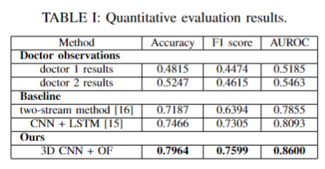

<div align="center">

Advanced Two-Stream Convolutional Neural Network for Video-Based Spinal Disease Measurement in Adult Spinal Deformity
===

</div>

## Abstract

Assessment of adult spinal deformity with video is a very useful tool for early diagnosis of the gait spinal disease.
At present, many gait recognition methods based on 3D convolutional neural networks (3D CNN) present outstanding performance, but still have some challenge in video-based diagnosis method.

1. 3D CNNs can be sensitive to context.
2. The body edge provides important spatial information that helps the network focus on the relevant regions for gait analysis and improves the overall performance of the recognition system. 
3. Meanwhile, it remains a challenge for the extraction of spatiotemporal information from RGB video for gait and posture changes in walking.
   
In this study, we propose an advanced two-stream 3D CNN approach for video based spinal disease measurement, that integrates segmentation and optical flow analysis to capture gait motion changes.
We design a two-stream 3D Convolutional Neural Network architecture that combines the spatial and temporal features. 
The spatial stream processes the segmented body regions to extract static features related to spinal deformity, while the temporal stream analyzes the optical flow information to capture the dynamic aspects of spinal motion during gait. 
The fusion of static and dynamic features enhances the diagnostic accuracy of the system.
Our experimental results demonstrate that the proposed method, incorporating segmentation and optical flow analysis, achieves superior performance in ASD diagnosis, with 0.7964 mean accuracy, 0.7599 F1 score and 0.8600 AUROC score.

## Description

📓 This project made with the PyTorch, PyTorch Lightning, PyTorch Video.

This project implements the task of classifying different medical diseases.

We use an advanced two stream based method combine the 3D CNN network for video classification.

The whole procedure is divided into two steps:  

1. using the detection method to extract the character-centered region and save it as a video.
2. a hidden-in RAFT based method to extract the optical flow of the corresponding images.
3. using the RGB images with the corresponding optical flow feed into a 3D CNN based network for training.

Detailed comments are written for most of the methods and classes.
Have a nice code. 😄

## Results

<div align="center">  </div>

<div align="center">  </div>

## How to run  

First, install dependencies

```bash
# clone project   
git clone https://github.com/ChenKaiXuSan/Two_Stream_PyTorch.git

# install project   
cd Two_Stream_PyTorch
pip install -e .   
pip install -r requirements.txt

```

Next, navigate to any file and run it.  

```bash
# module folder
cd project

# run module (example: mnist as your main contribution)   
python main.py --[some paramer]
```

## About the lib  

stop building wheels. 🛑

### PyTorch Lightning  

[PyTorch Lightning](https://pytorch-lightning.readthedocs.io/en/latest/) is the deep learning framework for professional AI researchers and machine learning engineers who need maximal flexibility without sacrificing performance at scale. Lightning evolves with you as your projects go from idea to paper/production.

### PyTorch Video  

[link](https://pytorchvideo.org/)
A deep learning library for video understanding research.

### detectron2

[Detectron2](https://detectron2.readthedocs.io/en/latest/index.html) is Facebook AI Research's next generation library that provides state-of-the-art detection and segmentation algorithms. It is the successor of Detectron and maskrcnn-benchmark. It supports a number of computer vision research projects and production applications in Facebook.

### Torch Metrics

[TorchMetrics](https://torchmetrics.readthedocs.io/en/latest/) is a collection of 80+ PyTorch metrics implementations and an easy-to-use API to create custom metrics.
