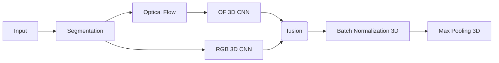

How to fuse the different features map from 3DCNN and Optical Flow?
===

A disscussion about the fusion method of different features map from 3DCNN and Optical Flow
---

## Introduction

In [Segmentation](./segmentation.md), we have discussed the importance of the segmentation in human gait recognition.
In [Optical Flow](./optical_flow.md), we have discussed the importance of the optical flow in human gait recognition.

The two methods are both useful for the human gait recognition, but how to fuse the different features map from 3DCNN and Optical Flow?

In general, we can use the simple way to fuse the different features map, such as,

- add 
- multiply
- concatenate

But, in this research, we need to find a way to fuse the different features map, which can make the model more robust.

So, how to fuse the different features map from 3DCNN and Optical Flow?

## Process

For visualize the importance of the fusion method in human gait, we simulated a neural network processing flow which contains the different parts.

Here, we discuss the different fusion method, and compare the different fusion method.

## Visualize the fusion method

In this section, we will visualize the different fusion method, and compare the different fusion method.

### Add

### Multiply

### Concatenate

## Compare the different fusion method
