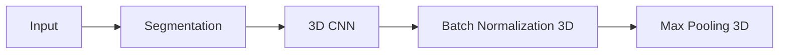
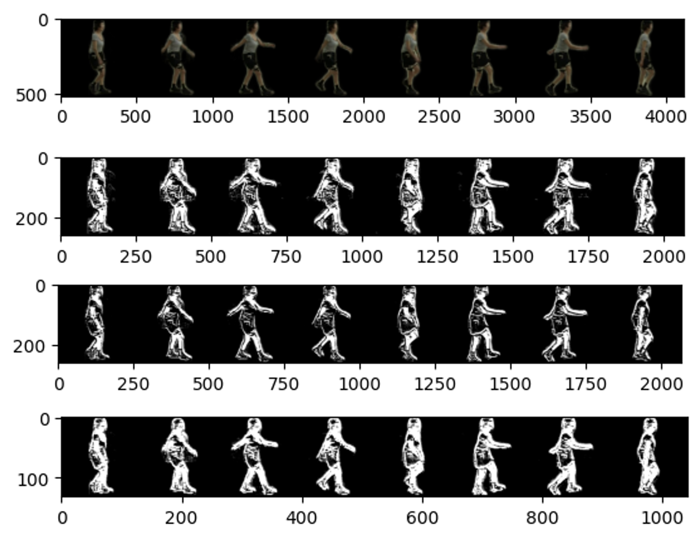
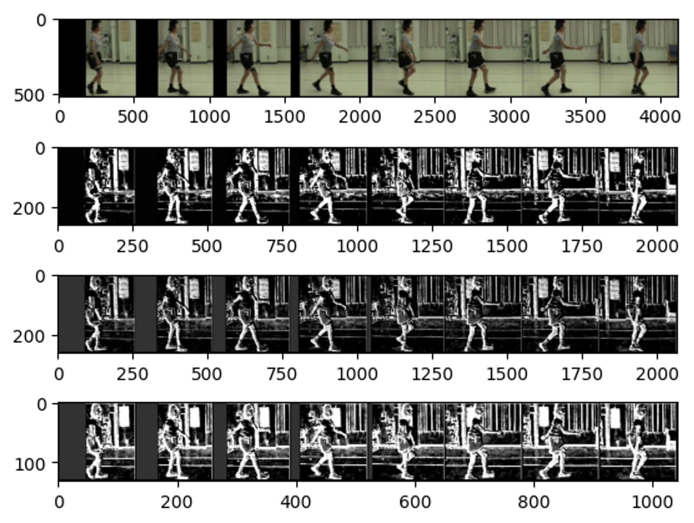

# Why we need segmentation in human gait recognition?

## A disscussion about the segmentation of the gait image in time series.

## Introduction

In human walking, we need to push CNNs take more attention to the human part, not the background.

But, in my opinion, 3D CNNs is very sensitive to the background, expecially the background is very complex, or the background is also moving.

So we need to find a way to specialization the human part.
A direct way is to estimate the human part, such as pose estimation, to get the joint keypoint of human part, and then use the keypoint to do some work.

But, if we can not use the pose estimation, how can we do?
One way is to use the segmentation to get the human part, on the other word, we can use the segmentation to get the **clean body edge**.

So we think the segmentation method is very useful for the gait recognition, in human walking.

## Process

For visualize the importance of the segmentation in human gait, we simulated a neural network processing flow which contains the different parts.



Here we list the parameters of different layers.
(The code is implemented by PyTorch)

```python
conv3d = Conv3d(in_channels=3, out_channels=1, kernel_size=(1, 7, 7), stride=(1, 2, 2), padding=(0, 3, 3))
bn3d = BatchNorm3d(num_features=1)
maxpool3d = torch.nn.MaxPool3d(kernel_size=(1, 3, 3), stride=(1, 2, 2), padding=(0, 1, 1))
```

### 3D CNN

The input channels for RGB image is set to 3, and the output channels is set to 1, for easy to visualize.
The kernel size is set to (1, 7, 7), which means the kernel size in time dimension is 1, and the kernel size in height and width dimension is 7.
The stride is set to (1, 2, 2), which means the stride in time dimension is 1, and the stride in height and width dimension is 2.
The padding is set to (0, 1, 1), which means the padding in time dimension is 0, and the padding in height and width dimension is 1.

The formula for calculating the output size is:

$$
D_{out} = \left[ \frac{(D_{in} + 2 \times padding[0] - dilation[0] \times (kernel\_size[0] - 1) - 1)}{stride[0]} +1 \right]
$$
$$
H_{out} = \left[ \frac{(H_{in} + 2 \times padding[1] - dilation[1] \times (kernel\_size[1] - 1) - 1)}{stride[1]} +1 \right]
$$
$$
W_{out} = \left[ \frac{(W_{in} + 2 \times padding[2] - dilation[2] \times (kernel\_size[2] - 1) - 1)}{stride[2]} +1 \right]
$$

### Batch Normalization 3D

Batch Normalization 3D is a 3D version of Batch Normalization.
The batch normalization is used to normalize the input data, and make the input data have the same distribution.
The num_features is set to 1, which means the input channels is 1.
(The num_features is equal to the output channels of the previous layer.)

### Max Pooling 3D

The motivation of using Pooling 3D layer is to reduce the size of the feature map.
The Pooling layer is always used after the Convolution layer, on other word, the Pooling layer is set after the CNN layer.

The kernel size is set to (1, 3, 3), which means the kernel size in time dimension is (1, 2, 2), and the kernel size in height and width dimension is (0, 1, 1).

> **Note** 
> The Pooling layer do not include the learnable parameters. It just decrease the size of the feature map.

## Visualization



<center>Figure 1. The visualization of segmentation results.</center>



<center>Figure 2. The visualization of no segmentation results.</center>

Figure 1 is the visualization of the segmentation results, and Figure 2 is the visualization of the no segmentation results.

In Figure 1, we can see that the segmentation results given a clean body edge, we think the segmentation results can make the CNNs pay more attention to the human part, not the background.

In Figure 2, we can see that the no segmentation results given a noisy body edge, and the background is changed frequently, because the background is also moving.
We think the no segmentation results can make the CNNs pay more attention to the background, not the human part.

## Conclusion

In summary, in this visualization, we compare the segmentation and no segmentation results, in human gait.

When training, we need CNNs to pay more attention to the human part, not the background.
One way is to use the segmentation to get the clean body edge, and then use the clean body edge to train the model.
On the other word, clean body edge can only contain the human part information, will drop the irrelevant information, such as the background.

We hope this visualization can help you understand the importance of the segmentation in human gait.